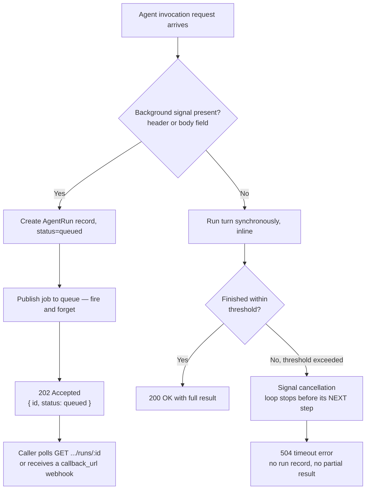

# Agent Background Execution

> **Status: Proposed / not yet implemented.** This document specifies the target design agreed for running long agent turns without holding an HTTP connection open indefinitely. It is the reference for the implementation work tracked separately; none of the endpoints, fields, or database methods described below exist in the codebase yet unless explicitly noted as "existing precedent." This revision incorporates a design review round — see [§12](#12-design-review-findings) for the objections raised, the evidence gathered to resolve them, and how each changed the design.

## 1. Problem

Invoking an agent (`POST /api/client/v1/agents/responses`, `/api/client/v1/responses`, and any other client-facing entry point that runs an agent turn) is currently a fully synchronous call: the HTTP request stays open for as long as `executeAgentChat` takes — model round-trips, tool-loop iterations, guardrail checks, everything — and only returns once the turn is fully resolved.

This breaks down for turns that legitimately take minutes rather than seconds:

- Intermediate infrastructure (load balancers, reverse proxies, serverless function timeouts, browser fetch timeouts, other tools/orchestrators calling the gateway) frequently caps connection duration well under what a complex agent turn can take.
- There is no reliable way to predict, **before running an agent**, how long a given turn will take — tool call count, model "thinking" iterations, and downstream latency (web search, a slow MCP server, etc.) are only known once the turn is already executing.
- A single execution model (open-and-wait) cannot serve both "give me the answer, I'm waiting" callers and "I know this will take a while, don't make me hold a connection open" callers well at the same time.

## 2. Design Decisions (agreed)

These were explicitly settled during design discussion and should not be re-litigated without a new decision record:

1. **No time-based auto-promotion.** The system never tries to guess that a turn "is probably going to be long" and silently switches it to background execution mid-flight. Guessing was considered and explicitly rejected — the caller is always in a better position to know than the server.
2. **The caller declares background mode up front**, via a header or request field sent with the original call — not a UI toggle. See [§4](#4-how-a-caller-requests-background-mode).
3. **Synchronous mode has a hard ceiling.** If a caller does *not* request background mode, the server waits up to a fixed, configurable threshold (see [§5](#5-synchronous-mode-hard-timeout)). If the turn is still running when the threshold is hit, **the turn is terminated** — not silently converted into a background job. The caller gets a clean timeout error, nothing more.
4. **These are the only two behaviors.** There is deliberately no third "soft" mode where the server waits, gives up waiting, but keeps the job alive server-side for the caller to poll later. That hybrid was considered and rejected in favor of the simpler contract in point 3.
5. **This concerns programmatic API callers, not the dashboard Playground.** The signal is something a caller's *code* sets on its HTTP request (header/body field) — it is not exposed as a checkbox anywhere in the Cognipeer dashboard. A human sitting in the Playground testing an agent is not the audience for this feature; see [§10](#10-out-of-scope).
6. **The synchronous ceiling must sit below the shortest infrastructure timeout in the deployment.** If a load balancer, reverse proxy, or serverless platform times out the connection *before* `AGENT_SYNC_TIMEOUT_MS` elapses, that infrastructure returns its own `504` first, our abort never fires on schedule, and the caller sees an opaque failure with no run to check on. Deploy-time configuration must set `AGENT_SYNC_TIMEOUT_MS` below the shortest such limit (LB idle timeout, API gateway timeout, function max duration, etc.) — this is an operational requirement, not just an application-level knob.
7. **A terminated synchronous call gives an honest, weaker guarantee than "stopped."** As established in the review (§12.2), the SDK's cancellation primitives stop the agent loop from starting its *next* step; they do not interrupt a tool call or model call already in flight. "Terminated" means: no further steps run, and the caller stops waiting. It does **not** mean any tool side effect already in progress at the moment of timeout is guaranteed to be interrupted.
8. **The worker never waits for `invoke()` to enforce a deadline — it races it.** Both the synchronous ceiling and the background `AGENT_BACKGROUND_MAX_DURATION_MS` are enforced with `Promise.race([invokePromise, deadlineTimer])`, not by awaiting `invoke()` and checking the clock afterwards. This matters specifically because §12.2 proved a single in-flight tool/model call is not interrupted by cancellation — if the deadline enforcement itself waited on that same `invoke()` call, a hung MCP call would hang the deadline enforcement too. See §12.13.
9. **A late-arriving `invoke()` result must never overwrite a decision already made about the turn.** If a deadline timer or a cancel request has already caused the turn to be treated as timed-out/canceled, the original `invoke()` promise is still running (Node.js cannot kill it) and will eventually settle on its own. When it does, its result is discarded: not persisted to the conversation, not used to flip a `failed`/`canceled` run back to `succeeded`. See §12.12.
10. **Exactly one rule for "only one active run per conversation," checked atomically at the same point regardless of mode.** Not "reject at request time for background but leave it queued forever if a worker sees a conflict," and not "background-only" — a *synchronous* request against a conversation that already has an active background run is rejected the same way. See §12.14.
11. **`Idempotency-Key` is a background-mode concept.** Synchronous mode does not persist a record to key off, so honoring the header there would be a no-op that looks like it works. See §12.15.

## 3. The Two Modes



### 3.1 Background mode (caller-declared)

- The request is accepted immediately (`202 Accepted`), without running any part of the turn inline.
- **Creating the `AgentRun` and checking the single-active-run rule (Decision 10) is one atomic operation, not a check followed by a separate write.** See §12.14: the insert is guarded by a partial unique index on `conversationId` for `status IN ('queued', 'running')`; a conflict is caught and mapped to `409 Conflict` at creation time, and no job is ever enqueued for the losing request. There is no "leave it `queued` forever, a worker will sort it out later" path — that would create a job that never runs, which is worse than rejecting it up front.
- The actual turn execution is handed to the existing job queue (`getQueue()` — the same BullMQ/memory abstraction already used by the crawler and batch subsystems).
- The caller gets back a run identifier and must either poll a status endpoint or supply a `callback_url` to be notified when the run finishes.
- Two independent upper bounds apply, not one: the agent's own `runtime.limits.maxWallClockMs` (self-imposed, per-agent, configured in the dashboard's Advanced Settings — pre-existing, unchanged by this design) **and** a server-operated `AGENT_BACKGROUND_MAX_DURATION_MS` ceiling that does not depend on the agent author having set anything (§12.5). Enforced by racing `invoke()`, not waiting on it (Decision 8, §12.13) — a single hung tool/MCP call cannot defeat this ceiling the way it defeats `cancellationToken` alone.

### 3.2 Synchronous mode (default, no signal given)

- **Before running inline, the same single-active-run check runs against `AgentRun`** (Decision 10, §12.14): if a background run is already `queued`/`running` for this `conversationId`, the synchronous request is rejected with `409 Conflict` before any turn execution starts — it does not silently run in parallel and race the background run's conversation write (§12.7's original finding).
- Otherwise the request is executed inline, exactly as today.
- The server enforces a **hard wall-clock ceiling** for the whole HTTP call (independent of, and expected to normally be shorter than, the agent's own `maxWallClockMs`, and shorter still than the deployment's infrastructure timeouts — see Decision 6 above), enforced by racing `invoke()` rather than awaiting it (Decision 8, §5, §12.13).
- If the turn finishes before the ceiling: normal `200 OK` with the full response, unchanged from current behavior.
- If the ceiling is reached before the turn finishes: the deadline timer wins the race, the HTTP response is `504` immediately (see §12.9 for why not `408`) — the handler does not wait for the original `invoke()` call to actually stop. The turn is not converted into a trackable background job, it does not get a run id, and it does not get retried automatically. The still-running `invoke()` call's eventual result is discarded when it arrives (Decision 9, §12.12) — it is never persisted to the conversation.

## 4. How a Caller Requests Background Mode

Because the same agent-invocation logic is reachable from more than one wire format (`/client/v1/agents/responses`, `/client/v1/responses`, and potentially future OpenAI-compatible surfaces such as `/client/v1/chat/completions` against an agent-backed model), the signal must be checked at a single shared point rather than duplicated per-endpoint, and it must work regardless of whether the specific request body shape has room for an extra field.

| Mechanism | Example | Applies to |
|---|---|---|
| HTTP header | `X-Cognipeer-Background: true` | Every endpoint, regardless of body shape. This is the primary, universal signal. |
| Body field | `"background": true` | Endpoints whose request schema naturally has room for it (mirrors OpenAI Responses API's own `background` field). |

Resolution order: if either is present and truthy, the request runs in background mode. The header is canonical because it is invocation-shape-agnostic; the body field exists so an unmodified OpenAI SDK client can set `background: true` the way it already knows how to. Whether the *rest* of that SDK's background flow (polling, cancel) works unmodified is a separate question — see [§8](#8-response-id-scheme) and [§12.3](#123-openai-sdk-compatibility-response-id-scheme).

This check must live in one shared helper, not be reimplemented per plugin file, so that every current and future client-facing agent entry point picks it up automatically.

## 5. Synchronous Mode Hard Timeout

- A single configurable ceiling (`AGENT_SYNC_TIMEOUT_MS`, default on the order of 2–5 minutes) via `getConfig()` — never read from `process.env` directly (per repo convention). Must be set below the shortest infrastructure timeout in the deployment (Decision 6).
- This is a **server-operated ceiling on the HTTP call**, not the agent's own internal budget (`runtime.limits.maxWallClockMs`).
- **Enforcement never waits for `invoke()` — it races it (Decision 8, §12.13):**
  1. At request entry, compute an absolute deadline (`now + AGENT_SYNC_TIMEOUT_MS`).
  2. Call `Promise.race([executeAgentChat(...), deadlineTimer(deadline)])` — `executeAgentChat` is the existing public entry point (`client-agents.ts`'s handler already calls this today), which internally still decides locally-vs-routed via `routeInstanceCall`; the race wraps whichever path it takes. The executing side additionally passes a remaining-time value into the SDK as `InvokeConfig.timeoutMs` / `cancellationToken` — a best-effort inner control (§12.2), not the thing that actually bounds the HTTP response.
  3. **If `deadlineTimer` wins:** return `504` to the caller immediately (see §12.9). Do **not** await the original `executeAgentChat(...)` promise first — it is still running (a hung tool/model call is not interrupted by cancellation alone, §12.2) and waiting for it would defeat the entire point of a hard ceiling. Do not persist any `AgentRun` record for a synchronous call — a terminated synchronous call leaves no queryable artifact by design.
  4. **The original promise is not abandoned, only detached from the response — and the guard against a late write lives INSIDE `executeAgentChatLocal`, not in the handler that raced it.** `executeAgentChatLocal` currently persists the turn with a single `db.updateAgentConversation(...)` call once `sdkAgent.invoke()` returns (`agentService.ts`, right after building `updatedMessages`) — that write happens as a side effect of the function running to completion, regardless of whether whoever called it is still listening for the result. Detaching the HTTP response from the promise (step 3) does **not**, by itself, stop that write from happening a moment later. The actual fix: `executeAgentChatLocal` accepts a small mutable cancellation cell (e.g. `{ deadlineAt?: number; cancelled: boolean }`, passed by reference) and checks it **immediately before** the `db.updateAgentConversation(...)` call — if the deadline has passed (sync) or `cancelled` has been flipped to `true` (background, set by the run's own poll loop observing `cancelRequestedAt` — §7), the write is skipped entirely and the turn is finalized as timed-out/canceled instead, regardless of what `invoke()`'s result actually contained (Decision 9, §12.12). This is what actually prevents the "504 now, conversation quietly gains a turn ninety seconds later" outcome — not merely ignoring the settled promise's return value at the call site, which would be too late.
- **What this reliably achieves:** the caller is never held past the ceiling, and a conversation write can never land after the caller has already been told the turn failed. **What this does NOT achieve:** interrupting a single tool call or model call that is *already in flight* when the deadline passes — that call keeps running, its side effects (if any) keep happening, and eventually its promise settles into the discarded continuation above. A tool call stuck on a hanging MCP server is not killed by this mechanism; that would require threading the same `AbortSignal` into every individual tool's own transport (HTTP fetch, MCP client call) inside `buildBoundTools` and the MCP bridge — a materially larger change, explicitly **out of v1 scope**.
- The response body must disclose that side effects may have already happened (§9) — the honest guarantee is "you stopped waiting," not "nothing happened."

## 6. Data Model — `AgentRun`

Precedent: this repeats the same shape already used by `ICrawlJob` (`src/lib/database/provider/types.domain.ts`, mixins in `mongodb/crawler.mixin.ts` + `sqlite/crawler.mixin.ts`) and by the batch subsystem (`IBatchJob`), but deliberately **diverges from the crawl-job precedent** on crash recovery and retry (§12.1) because agent turns can carry irreversible tool side effects that crawl jobs do not.

| Field | Type | Notes |
|---|---|---|
| `_id` | id | Run identifier. **Not** reused as the OpenAI-facing response id directly — see [§8](#8-response-id-scheme). |
| `mode` | `'sync' \| 'background'` | Which path created this row. A `'sync'` row exists **only** to hold the single-active-run reservation (below) for the duration of an inline call — it is always deleted when the call ends (success, timeout, or error), never left in a terminal `succeeded`/`failed` state and never intended to be polled. This is how §5's "a synchronous call persists no queryable artifact" and §7 step 1's "creation is atomic for both modes" coexist without contradicting each other. |
| `tenantId` / `tenantDbName` | string | Tenant isolation — stamped at creation, never re-derived mid-run. |
| `projectId` | string | Project scoping. **Required**, checked on every read/write path (§12.11) — not optional the way `IBatchJob.projectId` currently is. |
| `agentKey` | string | Which agent this run invokes. |
| `conversationId` | string | Conversation this turn is appended to. Guarded by a **partial unique index** so at most one active (`queued`/`running`) run can exist per conversation — see the note below the table and §12.14. |
| `userMessage` | string | The input that triggered the run. |
| `idempotencyKey` | string \| null | Caller-supplied, from an `Idempotency-Key` header — **background mode only** (§12.15, v1 minimum). A repeated key against an existing run of the same request returns the existing run instead of creating a new one; a repeated key with a *different* request body is rejected (§12.15). Not honored in synchronous mode, which persists no record to key off. |
| `status` | `'queued' \| 'running' \| 'succeeded' \| 'failed' \| 'canceled'` | Lifecycle. No `'timeout'` state — timeouts only happen in synchronous mode, which never creates a run record. |
| `errorReason` | `'agent_error' \| 'worker_lost' \| 'max_duration_exceeded' \| 'canceled_by_caller' \| null` | Distinguishes an agent-side failure, a worker that died mid-run (§12.1), the server-side background ceiling firing (§12.13), and an explicit caller cancel. |
| `result` | object \| null | The same response payload a synchronous call would have returned, once available. |
| `errorMessage` | string \| null | Populated on `failed`. |
| `cancelRequestedAt` | Date \| null | Crawler-proven pattern (`ICrawlJob.cancelRequestedAt`): set by a cancel request possibly arriving on a different node than the one executing the run; the owning worker observes it on its next poll. |
| `workerId` | string \| null | The node currently (or last) executing this run — see the reconciler in [§7.1](#71-crash-recovery-reconciler). |
| `heartbeatAt` | Date \| null | Updated periodically by the executing worker while `status = running`. A run whose heartbeat has gone stale is orphaned. |
| `callbackUrl` | string \| null | Optional webhook target. |
| `callbackStatus` | `'pending' \| 'delivered' \| 'failed' \| null` | Durable delivery state (§12.6) — not tracked purely in-process the way the crawler's webhook sender does today. |
| `callbackAttempts` | number | Incremented per delivery attempt, persisted so a process restart doesn't lose count. |
| `apiTokenId` | string | Attribution, mirrors other client-API entities. |
| `createdAt` / `startedAt` / `completedAt` | Date | Standard job timestamps. |
| `expiresAt` | Date | Retention cutoff (§12.10) — `userMessage`/`result` are not kept indefinitely. |

Both database providers (`src/lib/database/mongodb/`, `src/lib/database/sqlite/`) must implement the same contract methods — this is a hard project rule, not an optional nice-to-have (`docker-compose.yml` defaults to SQLite).

**Single-active-run index (§12.14):** the "at most one `queued`/`running` run per conversation" rule (Decision 10) is enforced by a partial unique index, not by a read-then-write check in application code:

- Mongo: `{ key: { conversationId: 1 }, options: { name: 'idx_agent_runs_active_per_conversation', unique: true, partialFilterExpression: { status: { $in: ['queued', 'running'] } } } }`, added to `TENANT_DB_INDEXES` in `indexManifest.ts` alongside the other tenant collections.
- SQLite: `CREATE UNIQUE INDEX IF NOT EXISTS idx_agent_runs_active_per_conversation ON agent_runs(conversationId) WHERE status IN ('queued', 'running');` (SQLite has supported partial indexes since 3.8.0; no existing index in `schema.ts` uses one yet, but the plain syntax is already the established convention there).
- Creating an `AgentRun` is an insert attempt, not a check-then-insert: a unique-constraint violation is caught and mapped to `409 Conflict` at the API layer. This removes the TOCTOU race a separate "does an active run already exist?" read would have.
- **Sync-mode rows and the reconciler.** A `mode: 'sync'` row is inserted with `status: 'running'` at the start of the inline call purely to occupy the reservation slot, and is unconditionally **deleted** (not finalized) when the call ends, on every path — success, `504` timeout, or thrown error — so it is never visible to `GET /runs/:id` under normal operation. If the process crashes mid-call, the row survives with a stale `heartbeatAt`; the same reconciler sweep (§7.1) that fails orphaned `background` rows instead **deletes** an orphaned `sync` row (there is no caller left polling it, and nothing to finalize), freeing the `conversationId` for future requests. Without this sweep, a crash mid-synchronous-call would permanently wedge that conversation behind the unique index.

## 7. Execution Path

Reuses existing infrastructure — no new queue technology:

1. **Create (atomic, both modes — §12.14):** attempt to insert the `AgentRun` row (`mode: 'background'`, `status: 'queued'` for a background request; `mode: 'sync'`, `status: 'running'` for an inline one — see the sync-mode note above). A unique-constraint violation on `conversationId` (an active run already exists) is caught and returned as `409 Conflict` immediately — for background mode, before any job is enqueued; for a synchronous request, before the turn runs inline at all (§3.2). There is no "leave it `queued`, a worker will reject it later" path.
2. **Enqueue** (background only): `queue.publish()` (fire-and-forget — not `queue.invoke()`, which is the existing *synchronous* RPC-style call used today for routing a chat turn to another node under `executeAgentChat`). The job payload is `{ runId }`; the worker loads everything else from the `AgentRun` record itself.
3. **Consumer**: extend `agentConsumer.ts` with a new job name (e.g. `run`) alongside the existing `chat` / `playground` handlers, calling a new `runAgentJobLocal(runId)` in a new `agentRunService.ts`.
4. **Claim**: atomic `queued → running` compare-and-swap, exactly like `db.claimCrawlJob` — required so a redelivered/duplicate queue message can never double-execute the same run and repeat its tool side effects. On success, stamp `workerId` (this node's identity) and start updating `heartbeatAt` on an interval.
5. **Race the turn against `AGENT_BACKGROUND_MAX_DURATION_MS` (§12.13):** call `Promise.race([executeAgentChatLocal(request, cancellationCell), deadlineTimer])`, exactly the same pattern as the synchronous path (§5) — never await `executeAgentChatLocal` and check the clock afterwards. `cancellationCell` is the same `{ deadlineAt, cancelled }` mutable reference described in §5 step 4; here `deadlineAt` is set from `AGENT_BACKGROUND_MAX_DURATION_MS`, independent of (and typically larger than) the agent's own `maxWallClockMs`.
   - **If `deadlineTimer` wins:** stop the heartbeat interval immediately, finalize the run as `failed` / `errorReason: 'max_duration_exceeded'` without waiting for `executeAgentChatLocal` to actually return, and fire the failure callback if one is registered. The abandoned `executeAgentChatLocal` call keeps running; its internal guard (§5 step 4) sees `cancellationCell.deadlineAt` has passed and skips the conversation write when it eventually gets there.
6. **Cancellation while running (caller-requested, not deadline):** the worker polls `cancelRequestedAt` on its **own dedicated, tight interval** (`CANCEL_POLL_INTERVAL_MS`, hardcoded ~1s — decoupled from the heartbeat write) and, if set, flips `cancellationCell.cancelled = true` — the same mutable reference `executeAgentChatLocal` is already checking (§5 step 4), so the SDK's `cancellationToken` stops the loop before its next step (§12.2 caveat applies identically here) **and** the conversation write is skipped regardless of what `invoke()` eventually returns.
   - **Why not piggy-back on the heartbeat write, as first drafted:** the heartbeat interval is deliberately slow (liveness/staleness signal for the §7.1 reconciler, default measured in seconds) and unrelated to cancel responsiveness. A turn that naturally completes faster than one heartbeat tick (the common case for a simple, tool-free call) would settle and get **written** before the flag was ever observed, silently defeating cancel entirely — confirmed in production testing. The crawler's own analogous mechanism is not actually its (also slow, per-page) heartbeat cadence either; it is a separate, tight `cancelPollTimer` (`crawlerJobService.ts`, 250ms) polling an in-memory flag. This design now mirrors that precedent with a DB round-trip since the cancel request may arrive on a different node.
7. **Finalize**: atomic `running → succeeded/failed/canceled`, mirroring `db.finalizeCrawlJob`. A run finalized early by step 5's timer race must not be overwritten back to `succeeded` if the abandoned promise later resolves cleanly — the finalize call itself is guarded the same CAS way `db.claimAgentRun` is (`running → X` only succeeds if the row is still `running`; the timer-driven `failed` transition already moved it out of `running`).
8. **Notify** (if `callbackUrl` present): deliver an HMAC-signed webhook. Delivery is retried through the queue (durable `attempts`/`backoff`, not an in-process `setTimeout` chain), and `callbackStatus`/`callbackAttempts` are persisted on the `AgentRun` so a process restart mid-retry doesn't silently drop the notification (§12.6). Fires on `failed` and `canceled` outcomes too, not only `succeeded`.

### 7.1 Crash Recovery (Reconciler)

Handles a **different failure mode** than step 5's deadline race above: the deadline race catches "a worker is alive but one step took too long"; the reconciler catches "the worker process itself died" (crash, OOM, redeploy) — in that case there is no live worker left to race anything, so heartbeat writes simply stop arriving.

Deliberately **does not** copy `crawlerJobReconciler.ts`'s "reset and re-run from scratch" behavior (§12.1):

- **Heartbeat, not boot-only.** A periodic sweep (not only at process boot) scans for `running` `AgentRun` rows whose `heartbeatAt` is older than a threshold (e.g. 3× the heartbeat interval) — this catches a worker dying at any point, not only "everyone rebooted together," and does not falsely touch a run whose owning node is healthy and simply belongs to a *different* still-running node (the gap identified in the crawler precedent, §12.1).
- **Default outcome is `failed`, not restart** (for `background` rows). Unlike a crawl (whose partial results can be discarded and re-fetched with no external consequence), an orphaned agent run may have already executed tool calls with real side effects (an email sent, a record updated). Re-running it from scratch would repeat those. The reconciler finalizes an orphaned `background` run as `failed` with `errorReason: 'worker_lost'`, fires the failure callback if one was registered, and does **not** automatically resubmit it.
- **Orphaned `sync` rows are deleted, not finalized** (§6) — there is no run status for a caller to poll for a synchronous call, only a reservation slot to free.
- A `queued` run whose message was lost (memory-queue restart, matching the crawler's documented failure mode) is safe to republish as-is, since it never started executing.

## 8. Response ID Scheme

Two ids coexist, deliberately kept separate rather than merged (§12.3):

- **Synchronous responses are unchanged**: `id: "resp_<conversationId>"`, exactly as today (`agentService.ts`, both call sites). Every turn in the same conversation returns the same id value — a pre-existing property of the current implementation, not something this design alters. Zero backward-compatibility risk for existing integrations.
- **Background/run responses get a per-run id**: `id: "resp_<runId>"`, unique per run (unlike the synchronous scheme).
- `previous_response_id` resolution (`conversationIdFromResponseId` in `client-agents.ts`) becomes dual-mode: try resolving the stripped id as an `AgentRun._id` first (look up the run, read its `conversationId`); if no matching run exists, fall back to today's behavior of treating it as a raw `conversationId` directly. This is the only call site that needs to change; A2A's `contextId` handling (`client-a2a.ts`) uses a structurally separate scheme and is unaffected.

### New client-facing surface

```
GET  /api/client/v1/agents/runs/:runId          — poll status + result
POST /api/client/v1/agents/runs/:runId/cancel   — cooperative cancel (queued or running)
```

Both endpoints resolve the run through the caller's `tenantId` **and** `projectId` — never `tenantId` alone (§12.11). A token cannot read or cancel a run belonging to a different project in the same tenant, even if it knows or guesses the run id.

Whether these become the *only* surface, or whether `/client/v1/responses/:id` and `/client/v1/responses/:id/cancel` are also exposed as a thinner adapter for unmodified-OpenAI-SDK callers (matching the SDK's actual `retrieve`/`cancel` paths and its `object: "response"` / `ResponseStatus` literals — confirmed against the installed `openai` package, §12.3), is an open implementation choice; the `/agents/runs/*` surface above is the source of truth either way.

### Status response shape (draft)

```json
{
  "id": "run_65f...",
  "object": "agent.run",
  "status": "running",
  "agent": "support-bot",
  "conversation_id": "665f...",
  "result": null,
  "error": null,
  "created_at": 1718409600,
  "started_at": 1718409601,
  "completed_at": null
}
```

### Initial (background) response shape

```json
HTTP/1.1 202 Accepted

{
  "id": "run_65f...",
  "object": "agent.run",
  "status": "queued",
  "created_at": 1718409600
}
```

## 9. Idempotency and Side-Effect Disclosure

- **`Idempotency-Key` is honored in background mode only (§12.15, v1 minimum).** Synchronous mode persists no `AgentRun` (§5) — there is nothing to key a repeat request against, so a naive "accept the header everywhere" would silently do nothing in sync mode while looking like it works. A synchronous request carrying an `Idempotency-Key` header is rejected with `400` (`"Idempotency-Key requires background: true"`) rather than silently ignored — an explicit, loud rejection instead of a quiet no-op, consistent with how this whole review has repeatedly found silent gaps worse than visible ones.
- **Background mode:** the key is looked up against `AgentRun.idempotencyKey` (scoped by `tenantId`+`projectId`, same as every other lookup) at creation time. If a run with that key already exists: same request body (compared by hash of `{ agentKey, conversationId, userMessage, version }`) → return the existing run (its current status, whatever that is) instead of creating a new one. Different request body under the same key → `409 Conflict` with an `idempotency_key_conflict` error type — the second request is neither silently executed nor silently merged into the first.
- **This does not undo tool side effects from a first attempt made without an idempotency key.** It only prevents a *second, retried* attempt (one that reuses the key) from repeating them.
- **The `504` timeout body must not imply nothing happened.** Confirmed by the SDK cancellation spike (§12.2): a tool call in flight at the moment of timeout runs to completion independent of the HTTP response already having been sent. The error body includes an explicit disclosure, e.g. `{ "error": { "type": "timeout", "message": "...", "side_effects_possible": true, "retryable": false } }`, so an integrator knows not to blindly retry a synchronous turn that may have already sent an email or written a record — and, since synchronous mode cannot use `Idempotency-Key` (above), retrying it is the caller's own responsibility to reason about, not something this design can protect against for the synchronous path.

## 10. Out of Scope

- **Dashboard Playground.** `executePlaygroundChat` is driven by a human watching the screen in real time; background mode has no meaning there and is not touched by this design.
- **Auto-promotion of a slow synchronous call into a background job.** Explicitly rejected (§2.3) — a synchronous call that overruns its ceiling is terminated, full stop.
- **Predictive/heuristic duration estimation.** Not part of this design.
- **True hard-kill of a single in-flight tool/model call.** As established in §12.2, neither `cancellationToken` nor `timeoutMs` interrupts a call already in progress; only threading an `AbortSignal` into every tool's own transport would achieve that, and that is a larger, separate piece of work tracked outside this design's v1.
- **Per-tenant/per-agent rate limiting on agent invocation.** `client-agents.ts` does not call the existing `checkRateLimit`/`checkPerRequestLimits` quota-guard functions today (`client-inference.ts` does, for `/chat/completions` and `/embeddings`) — that gap predates this feature and is tracked as a separate, independent fix, not bundled into this design.
- **`Idempotency-Key` support in synchronous mode.** Rejected outright (`400`), not implemented as a lighter version — see §9, §12.15.

## 11. Delivery Scope

Agreed phasing. Do not reorder without revisiting the dependencies below.

### Phase 0 — prerequisites (blocking, must land first)

- Wire `cancellationToken`/`timeoutMs` into `executeAgentChatLocal`'s `sdkAgent.invoke()` calls, and keep the empirical regression test that proved their actual (limited) behavior (§12.2) — promote or replace `src/__tests__/unit/_spike-agent-sdk-cancellation.test.ts`.
- Add the mutable `cancellationCell` parameter (`{ deadlineAt?: number; cancelled: boolean }`) to `executeAgentChatLocal` and gate its `db.updateAgentConversation(...)` call on it (§5 step 4, §12.12) — this is the one change shared by both the synchronous ceiling and background cancellation/max-duration, so it belongs in Phase 0, not duplicated later per-mode.
- Add the partial unique index on `AgentRun.conversationId` for active statuses, both providers (§6, §12.14).
- `getBatch`/`cancelBatch`/`getBatchItems` project-scoping fix — **already landed independently of this feature** (`src/lib/services/batch/batchService.ts`, `resolveOwnedBatchJob`), unblocks nothing else here but was surfaced during this review and fixed immediately as an unrelated security gap.

### v1 — mandatory

Findings from the review that must be designed in from the start, not bolted on later: **§12.1 (reconciler: heartbeat + workerId + fail-by-default), §12.3 (response id scheme), §12.5/§12.13 (background upper bound enforced by racing `invoke()`, not awaiting it), §12.7/§12.14 (one active run per conversation, atomic via partial unique index, `409` for sync and background alike), §12.9 (`504`, not `408`), §12.11 (tenant + project scoping on run endpoints), §12.12 (late-arriving `invoke()` result never persisted after a deadline/cancel already decided the turn).**

### v1 — minimum bar (lighter version acceptable, but not absent)

**§12.6 (callback delivery status persisted on the run + durable retry via the queue, not in-process `setTimeout`), §12.8 (a simple per-tenant/per-token concurrent-run cap returning `429`), §12.10 (retention/TTL on `userMessage`/`result`, following the `cleanupAgentTracingRetention` precedent), §12.15 (`Idempotency-Key`, background-mode only).**

## 12. Design Review Findings

This section is the record of the review round: the objection raised, what was verified in the codebase (or, for §12.2, verified with a written test) to resolve it, and the resulting design change. Kept here rather than deleted so the reasoning survives independent of whoever implements this next.

### 12.1 Reconciler: crash recovery must not repeat tool side effects, and must not be boot-only/node-blind

`crawlerJobReconciler.ts` treats every `running` row across every tenant as orphaned at boot, with no node-ownership field on `ICrawlJob` at all (confirmed: no `workerId`/`nodeId`/`hostname` in `types.domain.ts`) — safe for a crawl (its default recovery is to discard partial results and restart from scratch, safe because a crawl retry is fully idempotent), but not safe for two reasons specific to agent runs and to true multi-node deployments:

1. **Restart-and-retry repeats tool side effects.** An agent run that had already called a tool (send an email, update a record) before its worker died would, under the crawler's pattern, be reset to `queued` and re-executed — repeating that side effect.
2. **A boot-only, node-blind sweep is unsafe with more than one node.** Node A restarting and running its reconciler would incorrectly reclaim a job that a healthy Node B is still actively running, since nothing distinguishes "mine" from "not mine."

**Resolution:** `AgentRun` gets `workerId` + `heartbeatAt` (§6); a periodic (not boot-only) sweep fails any run whose heartbeat has gone stale, with `errorReason: 'worker_lost'`, and does not auto-restart it (§7.1).

### 12.2 Abort mechanics — verified with a written test, not assumed

Wrote and ran `src/__tests__/unit/_spike-agent-sdk-cancellation.test.ts` against the actually-installed `@cognipeer/agent-sdk@0.10.3`, using the same `ScriptedModel`/`createTool` harness the existing `agent-turn-state.test.ts` uses. Four scenarios:

| Scenario | Result |
|---|---|
| `cancellationToken` aborted at 100ms while a tool call is 400ms in flight | `invoke()` resolved normally at ~408ms — the abort had no observable effect. Tool's side effect committed at ~401ms regardless. |
| `timeoutMs: 100` set, tool call is 400ms | Same — `invoke()` resolved at ~403ms; `timeoutMs` did not cut the tool call short. |
| `cancellationToken` already aborted **before** `invoke()` is called | The model was never called (`modelCalls: 0`), the tool never started — pre-abort is honored. |
| Tool 1 finished, abort fires **while** model-call-2 (150ms) is in flight | Model-call-2 ran to its full 150ms (not cut short); `invoke()` then resolved (~317ms) **without** starting tool-2. |

Conclusion: cancellation is checked at a loop **checkpoint** — after a step (model call or tool call) finishes, before the next one starts. It does not interrupt whichever call is currently in flight. This is also consistent with the SDK's own tool function type, `SmartToolFn = (args: any) => Promise<any> | any` (`node_modules/@cognipeer/agent-sdk/dist/index.d.ts:2679`) — there is no second (context/signal) parameter for a tool implementation to even receive an abort signal, so no user-defined tool (including ours, confirmed separately: zero `AbortSignal`/`AbortController` usage anywhere in `agentService.ts` today) has a way to cooperate with cancellation from inside its own body.

**Design consequence:** documented as an explicit, honest limitation rather than an implied guarantee (Decision 7, §5, §9) instead of silently promising a "hard kill" the mechanism cannot deliver. A true hard-kill of a single hung tool/MCP call is out of v1 scope (§10).

### 12.3 OpenAI SDK compatibility / response id scheme

Checked the installed `openai` npm package directly: `retrieve()` calls `GET /responses/{id}` and `cancel()` calls `POST /responses/{id}/cancel` (`node_modules/openai/resources/responses/responses.js`), and the `Response` type is pinned to `object: 'response'` with `type ResponseStatus = 'completed' | 'failed' | 'in_progress' | 'cancelled' | 'queued' | 'incomplete'` (`node_modules/openai/resources/responses/responses.d.ts:3164`). An originally-considered `/agents/runs/:runId` resource with `object: "agent.run"` and `succeeded`/`canceled` status literals would not be reachable by an unmodified OpenAI SDK client despite the `background: true` field being accepted at creation time.

Also checked `resp_<conversationId>` id generation (`agentService.ts`, both `executeAgentChatLocal` and `executePlaygroundChatLocal`): every synchronous turn in the same conversation returns the *same* id value today (id is conversation-scoped, not turn-scoped) — a pre-existing property, not something this feature needs to preserve by choice so much as by necessity (changing it would be a much larger, unrelated backward-compatibility decision). `conversationIdFromResponseId` (`client-agents.ts:141`) is today a pure string-prefix-strip with no DB lookup. A2A's `contextId` (`client-a2a.ts`) is a structurally separate scheme, unaffected either way.

**Resolution:** keep the synchronous scheme exactly as-is (§8); give background/run responses their own per-run id (`resp_<runId>`); make `conversationIdFromResponseId` try a run lookup first and fall back to the legacy raw-conversationId behavior. Whether a thin `/client/v1/responses/:id` adapter is also exposed for drop-in OpenAI SDK polling/cancel is left as an implementation choice (§8), but the object/status vocabulary for *that* surface, if built, must match the SDK's literals exactly, not our own invented ones.

### 12.4 Idempotency and side-effect disclosure on timeout

A synchronous timeout does not roll back tool side effects already committed (§12.2 makes this concrete: a tool call in flight keeps running after the HTTP response is already sent). Codebase has no existing `Idempotency-Key` concept (`grep -rn "Idempotency" src` — no results). Original resolution: `Idempotency-Key` support (v1 minimum) plus explicit disclosure in the timeout error body. **Refined in §12.15**: since synchronous mode persists no record (§5), the key is honored in background mode only; synchronous mode rejects it explicitly rather than silently no-op'ing.

### 12.5 Background mode needs a server-side upper bound independent of the agent's own limit

`agentConfigValidation.ts` validates `runtime.limits.maxWallClockMs` with only a floor (`min: 1_000`), no ceiling, and it can be left unset entirely. `BullMQQueueProvider.buildAddOptions()` sets `attempts`/`backoff`/`delay`/`removeOnComplete`/`removeOnFail`/`jobId` only — nothing enforces how long a worker may take on a single job. Original resolution: `AGENT_BACKGROUND_MAX_DURATION_MS`, a second, server-operated ceiling that does not depend on what the agent author configured. **Refined in §12.13**: given §12.2's finding that cancellation does not interrupt an in-flight call, the ceiling must be enforced by *racing* `invoke()`, not by passing a value into it and waiting — otherwise a hung tool/MCP call defeats the ceiling exactly the way it defeats plain `cancellationToken`.

### 12.6 Callback delivery must survive a process restart

`sendCrawlerWebhook` (`crawlerWebhook.ts`) is 3 attempts with in-process `setTimeout` backoff (~7 seconds total) and no persisted delivery state — if the process dies mid-retry, the notification is lost with only a log line, and there is no DB record to know it was ever attempted. Batch has no webhook mechanism to compare against at all. Resolution: §6 / §7 step 8 — `callbackStatus`/`callbackAttempts` persisted on `AgentRun`, retries driven through the durable queue (`attempts`/`backoff`) rather than an in-process timer chain, firing on `failed`/`canceled` as well as `succeeded`.

### 12.7 Concurrent runs against the same conversation

`updateAgentConversation` (`mongodb/agent.mixin.ts:184`, `sqlite/agent.mixin.ts:222`) does a whole-array `$set` of `messages` with no optimistic-concurrency guard (no version field, no precondition beyond `_id`). Two turns executing concurrently against the same `conversationId` both read the same starting `messages`, both append their own turn, and whichever writes last silently erases the other's turn from history — even though that turn fully executed and its result was already returned to its caller. Original resolution: reject (`409`) a second *background* request against a conversation that already has one `queued`/`running`. **Refined in §12.14**: a synchronous request against a conversation with an active background run must be rejected the same way (a sync-vs-background race is the exact same erasure, just with one side inline instead of queued), and the check-then-reject must be atomic (a partial unique index, not a separate read before the write) to actually close the race rather than narrow it.

### 12.8 Capacity and fairness

`client-agents.ts` does not call the existing `checkRateLimit`/`checkPerRequestLimits` (`@/lib/quota/quotaGuard`) at all today — confirmed absent, unlike `client-inference.ts` which does use them for `/chat/completions`/`/embeddings`. That gap is tracked separately (§10) since it predates and is independent of this feature. What *is* in scope here: `checkRateLimit` itself is a requests-per-time-window limiter, not a concurrent-in-flight-jobs counter, so it would not answer "how many runs does this tenant have queued/running right now" even if wired in. Resolution (v1 minimum, §11): a simple per-tenant/per-token count of `queued`+`running` `AgentRun` rows, `429` past a configured cap.

### 12.9 Timeout status code

`408 Request Timeout` is semantically about the client being slow to send its request, and several HTTP clients/resilience libraries treat it as auto-retryable — compounding the side-effect-repetition risk (§12.4/§9). Resolution: `504 Gateway Timeout` (§3.2, §5), which correctly signals "the upstream processing exceeded a deadline," paired with an explicit non-retryable disclosure in the body (§9).

### 12.10 Retention

Neither crawl jobs/results nor batch jobs have any TTL/cleanup mechanism today. Tracing, however, already has exactly this pattern done correctly: `cleanupAgentTracingRetention` (`mongodb/tracing.mixin.ts:618`, `sqlite/tracing.mixin.ts:175`), tenant-configurable, invoked on write paths in `client-tracing.ts`. Resolution (v1 minimum, §11): `AgentRun` gets an `expiresAt` (§6) and an equivalent `cleanupAgentRunRetention` following the tracing precedent rather than the crawler/batch gap.

### 12.11 Authorization scoping

Tenant isolation is structurally enforced (each tenant has its own database; `withTenantDb(ctx.tenantDbName)` cannot reach another tenant's data). Project-level scoping is **not** structural — it is each service function's own responsibility, and it is inconsistently applied today: `client-agents.ts`'s conversation lookup explicitly checks `conversation.projectId !== projectId` (with a comment naming exactly this class of cross-project leak), while `batchService.ts`'s `getBatch`/`cancelBatch`/`getBatchItems` checked `tenantId` only, letting a token from a different project in the *same* tenant read or cancel another project's batch by id. That batch gap has been fixed independently of this feature (§11, Phase 0) as soon as it was found. Resolution for this feature: the new run endpoints (§8) must check `tenantId` **and** `projectId` from day one, following the conversation-lookup precedent, not the (former) batch-lookup gap.

### 12.12 A late-arriving `invoke()` result must not overwrite a decision already made

Second-round question: given §12.2's finding (`invoke()` resolves *normally*, with no error, even when cancellation was signaled mid-tool-call — it simply keeps going), is it actually possible for a `504`'d synchronous turn to still get written to the conversation afterwards, or for a canceled background run to still finalize as `succeeded`? **Yes, verified by re-reading the exact code path**: `executeAgentChatLocal` (`agentService.ts`) calls `db.updateAgentConversation(...)` unconditionally once `sdkAgent.invoke()` returns — there is no existing check of "was this turn superseded" before that write, and the write is a side effect of the function *running*, not something the caller opts into after inspecting a return value. Detaching the HTTP response from the promise (§5 step 3) does not, by itself, stop that write — the function keeps executing to completion regardless of whether its caller is still waiting on it.

**Resolution**: the guard must live **inside** `executeAgentChatLocal`, immediately before the conversation write, not in whichever code raced it externally. `executeAgentChatLocal` takes a small mutable reference — `cancellationCell: { deadlineAt?: number; cancelled: boolean }` — passed by the caller (the sync HTTP handler for the deadline case, the background worker's poll loop for the cancel-flag case) and checked once right before `db.updateAgentConversation(...)`:

- If `Date.now() > cancellationCell.deadlineAt` (sync path) or `cancellationCell.cancelled === true` (background path, flipped asynchronously by the worker's own dedicated, tight cancel-poll of `cancelRequestedAt` (independent of the heartbeat interval)), the conversation write is **skipped entirely** — the turn's answer, however complete it looks, is discarded, and the caller (HTTP handler or background worker) finalizes the outcome as timed-out/canceled instead.
- Because the same object reference is shared, the background worker can flip `cancelled` asynchronously from its own poll loop while `executeAgentChatLocal` is still mid-flight, without needing a second function signature or a different code path per mode.
- This is a single shared change (§11, Phase 0) — both the synchronous ceiling and background cancellation/max-duration reuse it, rather than each mode inventing its own guard.

### 12.13 Enforcing `AGENT_BACKGROUND_MAX_DURATION_MS` (and the synchronous ceiling) by racing, not waiting

Second-round question: with a hung tool/MCP call, `cancellationToken` has no effect (§12.2), the heartbeat write is on its own independent timer so it keeps updating even while the turn is stuck, and the crash reconciler (§7.1) only fires on a *stale* heartbeat — so nothing catches a worker that is alive but permanently stuck on one call. Confirmed: as designed in the first round, `AGENT_BACKGROUND_MAX_DURATION_MS` was described as "passed to the SDK," i.e. awaited, which inherits exactly the same blind spot as `cancellationToken` alone.

**Resolution**: both ceilings are enforced by **racing** the turn's execution against a deadline timer (`Promise.race`), never by awaiting the turn and checking the clock afterward:

- **Background** (§7 step 5): `Promise.race([executeAgentChatLocal(request, cancellationCell), deadlineTimer])`. If the timer wins: stop the heartbeat interval immediately (so the reconciler does not also separately fail this run later as `worker_lost` once its heartbeat goes stale — one run, one terminal cause), finalize the run as `failed` / `errorReason: 'max_duration_exceeded'` without waiting for `executeAgentChatLocal` to return, and fire the failure callback. The abandoned call keeps running in the background; when it eventually settles, §12.12's guard (same `cancellationCell`, `deadlineAt` already passed) discards its result.
- **Synchronous** (§5 steps 2–4): identical pattern, `Promise.race([executeAgentChat(...), deadlineTimer])`, `504` returned the instant the timer wins.
- `errorReason` gains `'max_duration_exceeded'` (§6) as a value distinct from `'worker_lost'` (reconciler-caught process death) and `'canceled_by_caller'` (explicit cancel endpoint) — three different causes should not collapse into one generic `'agent_error'`.
- The `finalize` step's own CAS (`running → X` only from `running`) prevents a double-write: if the timer already moved the run to `failed`, the abandoned call's own eventual (illusory) success can't flip it back to `succeeded` even if §12.12's guard were somehow bypassed — belt and suspenders.

### 12.14 One active run per conversation — one rule, checked atomically

Second-round questions, both confirmed as real gaps in the first-round text:

1. **Only background-vs-background was covered.** A *synchronous* request racing an already-active *background* run against the same conversation hits the exact same `updateAgentConversation` whole-array overwrite described in §12.7 — a synchronous caller does not become safe from that race just because the other side happens to be a background job instead of another synchronous request.
2. **§3.1 and the original §7 step 4 described two different behaviors** — "reject the incoming request with `409`" versus "leave the losing job `queued` and let a worker silently decline to claim it." The second creates a job that never runs and never reaches a terminal state on its own, which is worse than the race it was meant to prevent — nothing later notices or reports it, whereas the reconciler (§7.1) actively acts on genuinely stuck runs.

**Resolution**: one rule, enforced at creation for both modes: **before running a turn (sync) or enqueuing a run (background), attempt an atomic insert/check against a partial unique index on `AgentRun.conversationId` scoped to `status IN ('queued', 'running')`** (§6). A conflict is caught and returned as `409 Conflict` at the same point regardless of which mode triggered it, and — critically — a losing background request never creates an `AgentRun` row and never reaches the queue at all, so there is no "stuck in `queued` forever" state to later clean up. A check-then-insert (a read, followed by a separate write) was considered and rejected: it reopens the same TOCTOU race a unique-index-backed insert closes for free.

### 12.15 Idempotency scope

Second-round question: since synchronous mode persists no `AgentRun` (§5), an `Idempotency-Key` sent on a synchronous call that then `504`s has nothing to look up on retry — the header would be accepted and silently do nothing, which is a worse outcome than not supporting it, because the caller believes they are protected when they are not.

**Resolution**: `Idempotency-Key` is a background-mode-only concept (§9). A synchronous request carrying the header is rejected with `400` rather than silently accepted-and-ignored. In background mode, the key is checked against `AgentRun.idempotencyKey` (scoped by `tenantId`+`projectId`) at creation time: same key + same request body (compared by a hash of `{ agentKey, conversationId, userMessage, version }`) returns the existing run; same key + a *different* body is a genuine conflict, not silently resolved either way — `409` with an `idempotency_key_conflict` error type, distinct from the `409` used for §12.14's single-active-run rule so a caller can tell the two apart.

## 13. Implementation Checklist

Ordered by **dependency**, not by section number — complete a group (including its own verification) before starting the next; later groups assume earlier ones already work. Written so a fresh agent session with no other context can pick this up and start immediately. Every referenced file already exists in the repo except where marked **(new)**.

### Group A — Data model foundation (blocks everything else)

- [ ] `src/lib/database/provider/types.domain.ts` (or `types.extended.ts`, matching wherever `IBatchJob` lives): add `IAgentRun` with every field from §6 — including `mode`, `errorReason` (with `max_duration_exceeded`), `cancelRequestedAt`, `workerId`, `heartbeatAt`, `callbackStatus`/`callbackAttempts`, `idempotencyKey`, `expiresAt`.
- [ ] `src/lib/database/provider/contract.ts`: add method signatures — `createAgentRun` (insert; must surface a distinguishable conflict error for §12.14's unique-index violation, not a generic throw), `claimAgentRun` (`queued → running` CAS, §7 step 4), `updateAgentRunHeartbeat`, `requestAgentRunCancel` (sets `cancelRequestedAt`), `finalizeAgentRun` (`running → succeeded/failed/canceled` CAS, §7 step 7), `getAgentRunById`, `listStaleAgentRuns` (heartbeat-sweep input for §7.1), `deleteAgentRun` (sync-mode cleanup, §6), `cleanupAgentRunRetention` (§12.10).
- [ ] `src/lib/database/mongodb/agent-run.mixin.ts` **(new)**, mirroring `crawler.mixin.ts`: implement every contract method above against a new `agent_runs` collection.
- [ ] `src/lib/database/sqlite/agent-run.mixin.ts` **(new)** + `src/lib/database/sqlite/schema.ts`: add the `agent_runs` table and the same contract methods. Include the partial unique index exactly as written in §6.
- [ ] `src/lib/database/mongodb/indexManifest.ts`: add the `agent_runs` partial unique index (§6) to `TENANT_DB_INDEXES`, plus a supporting index for the heartbeat sweep (`{ status: 1, heartbeatAt: 1 }`) and for retention cleanup (`{ expiresAt: 1 }`).
- **Definition of done:** both providers implement identical contract methods (project rule — neither may lag behind the other); a conflicting insert on `conversationId` is provably rejected by the DB itself in both, not by application-level pre-checking.

### Group B — Phase 0 prerequisite: cancellation plumbing (independent of Group A, can run in parallel)

- [ ] `src/lib/services/agents/agentService.ts`: add an optional `cancellationCell?: { deadlineAt?: number; cancelled: boolean }` to `AgentChatRequest`; in `executeAgentChatLocal`, pass it into `sdkAgent.invoke()`'s `InvokeConfig` as `timeoutMs`/`cancellationToken`, **and** — the part that actually matters (§12.12) — check it immediately before the `db.updateAgentConversation(...)` call and skip that write if the deadline has passed or `cancelled` is `true`.
- [ ] Promote `src/__tests__/unit/_spike-agent-sdk-cancellation.test.ts` into a permanent regression test (drop the `_spike-` prefix; keep the four existing scenarios; add one asserting the new `cancellationCell`-gated skip actually prevents the conversation write).
- **Definition of done:** the promoted test passes; a new test proves a late-arriving `invoke()` result (deadline already elapsed) does not call `updateAgentConversation`.

### Group C — Config

- [ ] `src/lib/core/config.ts`: add `AGENT_SYNC_TIMEOUT_MS` (default 2–5 min, §5) and `AGENT_BACKGROUND_MAX_DURATION_MS` (§12.13) to the config schema, read via `getConfig()` — never `process.env` directly (repo convention).

### Group D — Synchronous ceiling (v1 mandatory; needs Groups A–C)

- [ ] `src/server/api/plugins/client-agents.ts` (`createResponsesHandler`): before running inline, attempt the single-active-run insert (`mode: 'sync'`, §12.14) — on conflict, return `409` immediately.
- [ ] Wrap the turn with `Promise.race([executeAgentChat(...), deadlineTimer])` using `AGENT_SYNC_TIMEOUT_MS` (§5, §12.13); on timeout, return `504` with the disclosure body (§9) without waiting for the raced-out call; delete the `mode: 'sync'` `AgentRun` row on **every** exit path — success, timeout, and thrown error alike.
- **Definition of done:** a test with a deliberately slow `executeAgentChat` proves the handler returns `504` at the deadline, not when the slow call eventually finishes; a second sync or background request against the same conversation gets `409` while the first is in flight.

### Group E — Background execution core (v1 mandatory; the largest group; needs Groups A–C)

- [ ] `src/lib/services/agents/agentRunService.ts` **(new)**: `runAgentJobLocal(runId)` implementing §7 steps 3–8 (claim, race against `AGENT_BACKGROUND_MAX_DURATION_MS`, heartbeat, cancellation poll, finalize, callback notify).
- [ ] `src/lib/services/agents/agentConsumer.ts`: register a new `run` job name alongside the existing `chat`/`playground` handlers, calling `runAgentJobLocal`.
- [ ] `src/server/api/plugins/client-agents.ts`: shared helper to detect the background signal (§4 — header + body field, usable from every current/future entry point, not reimplemented per plugin), create the `AgentRun` (`mode: 'background'`), `queue.publish()` the job, return `202` (§8).
- [ ] New endpoints — either in `client-agents.ts` or a new `client-agent-runs.ts` plugin: `GET /client/v1/agents/runs/:runId` and `POST /client/v1/agents/runs/:runId/cancel`, both checking `tenantId` **and** `projectId` (§12.11), never `tenantId` alone.
- [ ] `client-agents.ts`: make `conversationIdFromResponseId` dual-mode — try an `AgentRun` lookup by id first, fall back to today's raw-conversationId behavior (§8, §12.3). Background/run responses get `resp_<runId>`; the synchronous path's `resp_<conversationId>` stays untouched.
- **Definition of done:** a background request returns `202` plus a pollable run id; polling reflects `queued → running → succeeded`; a second background request on the same conversation gets `409`; canceling a running run stops the loop before its next step and the run finalizes as `canceled`, never `succeeded` (§12.12's guard proven, not assumed).

### Group F — Crash recovery (v1 mandatory; needs Groups A and E)

- [ ] `src/lib/services/agents/agentRunReconciler.ts` **(new)**, mirroring `crawlerJobReconciler.ts` but with the deliberate divergences from §7.1/§12.1: heartbeat-staleness sweep (not boot-only); `failed` + `errorReason: 'worker_lost'` for orphaned `background` rows with **no** auto-restart; **delete** (not finalize) for orphaned `sync` rows.
- [ ] Register the periodic sweep — check whatever periodic-scheduling primitive `analysisScheduler.ts`/`agentScheduler.ts` already use and follow that convention rather than inventing a new one; wire into `src/server/bootstrap.ts` alongside `reconcileOrphanedCrawlJobs()`.
- **Definition of done:** a test that fabricates a stale `background` run (old `heartbeatAt`) gets failed with `worker_lost` by the sweep; a fabricated stale `sync` row gets deleted, not finalized.

### Group G — v1 mandatory polish

- [ ] Confirm every timeout response uses `504`, never `408` (§12.9), across both the synchronous handler and any run-cancel-related timeouts.
- [ ] Confirm every new error response matches the existing `{ error: { type, message, ... } }` envelope already used in `client-agents.ts` for guardrail blocks and classified agent errors — do not invent a new shape.

### Group H — v1 minimum bar (can land after Group E; independent of each other)

- [ ] **Callback durability (§12.6):** replace an in-process retry with a queue-driven one (durable `attempts`/`backoff` via `getQueue()`), persisting `callbackStatus`/`callbackAttempts` on `AgentRun` after every attempt. Consider extracting a shared webhook-sending helper out of `crawlerWebhook.ts` rather than copy-pasting its HMAC/SSRF logic a second time.
- [ ] **Concurrency cap (§12.8):** a per-tenant/per-token count of `queued`+`running` `AgentRun` rows checked in the background-creation path; `429` past a configured cap.
- [ ] **Retention (§12.10):** `expiresAt` set at creation (config-driven TTL); a `cleanupAgentRunRetention` invoked the same way `cleanupAgentTracingRetention` is invoked in `client-tracing.ts` — on write paths, following that exact precedent rather than inventing a new cleanup trigger.
- [ ] **Idempotency (§12.15):** `Idempotency-Key` handling in the background-creation path only; `400` if present on a synchronous request; `409 idempotency_key_conflict` on a same-key-different-body background request (body hash over `{ agentKey, conversationId, userMessage, version }`).

### Group I — Explicitly not part of this implementation

- Do not touch `executePlaygroundChat*` (§10).
- Do not add per-tenant/per-agent rate limiting to `client-agents.ts` (§10) — track as a separate, independent fix.
- Do not thread an `AbortSignal` into individual tool transports (`buildBoundTools`, the MCP bridge) to achieve a true hard-kill of a single hung call (§10) — explicitly out of v1 scope.
- Do not build a `/client/v1/responses/:id` OpenAI-SDK-compatible adapter unless separately requested — §8 leaves it as an open implementation choice, not a requirement of v1.
